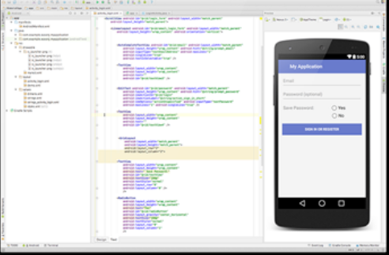

# LeboncoinApp – Application mobile de petites annonces

**LeboncoinApp** est un projet Android développé avec **Java** et **Android Studio**, inspiré de la célèbre plateforme de petites annonces Leboncoin.  
L’application permet aux utilisateurs de **se connecter**, **publier des annonces**, **consulter les annonces existantes** et **contacter directement un annonceur** en cliquant sur son numéro de téléphone.

---

## 📱 Aperçu

## ✨ Fonctionnalités principales

- Authentification des utilisateurs
- Création et publication d’annonces avec image
- Consultation des annonces en ligne
- Appel direct depuis une annonce (clic sur le numéro de téléphone)
- Interface utilisateur intuitive et responsive

---

## 🛠️ Technologies utilisées

- **Langage :** Java  
- **IDE :** Android Studio  
- **APIs REST :** pour l’envoi et la récupération des annonces  
- **Bibliothèques externes :**  
  - Accès à la caméra pour ajouter des photos aux annonces  
  - Intégration d’outils tiers pour améliorer l’ergonomie et la compatibilité

---

## 🎯 Objectifs pédagogiques

Ce projet m’a permis de :

- Me familiariser avec le **développement mobile Android**
- Concevoir des **interfaces utilisateurs modernes et fonctionnelles**
- Utiliser des **bibliothèques externes** pour enrichir l'expérience utilisateur
- Implémenter la **communication avec des serveurs distants via des APIs**
- Gérer des fonctionnalités complexes comme l’appel téléphonique intégré ou l’ajout d’images via la caméra

---

## 🚀 Lancement de l’application

1. Ouvrir le projet dans Android Studio  
2. Lancer l’émulateur ou connecter un appareil Android  
3. Compiler et exécuter l'application

---

## 📌 À propos

Ce projet a été réalisé dans le cadre de mon apprentissage du développement mobile. Il m’a permis d’acquérir une solide expérience pratique et de comprendre les étapes clés de la conception d’une application Android complète.

