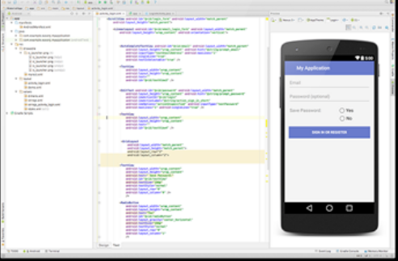

# 📱 LeboncoinApp – Application mobile de petites annonces

## 📄 Description courte
Application mobile Android développée en Java inspirée de la plateforme Leboncoin. Elle permet aux utilisateurs de créer un compte, de publier des annonces avec photos et d'entrer en contact directement avec les vendeurs par téléphone. Une solution fluide et responsive connectée à des APIs REST.

---

## 📖 Description détaillée
LeboncoinApp est une application mobile native conçue sous Android Studio mettant en œuvre les principes fondamentaux du développement Android en Java. Le projet s'articule autour d'une architecture client-serveur communiquant via des APIs REST pour la gestion et la synchronisation des annonces en temps réel.

L'application intègre une gestion complète du matériel et de l'OS Android : capture de photos via la caméra de l'appareil pour l'illustration des annonces, gestion des permissions, et interaction directe avec les fonctions d'appel du téléphone (Intent d'appel sur clic d'un numéro). L'interface utilisateur privilégie la lisibilité et la réactivité sur tous les formats d'écrans.

---

## ✨ Fonctionnalités du projet
- 🔐 **Authentification utilisateur** : Création de compte et connexion sécurisée.
- 📸 **Publication d'annonces** : Formulaire d'ajout d'annonces intégrant la prise de vue directe via la caméra.
- 📋 **Flux d'annonces** : Consultation et recherche des petites annonces enregistrées en ligne.
- 📞 **Contact direct** : Déclenchement automatique d'un appel téléphonique en cliquant sur le numéro d'un annonceur.
- 📱 **UI Responsive & Native** : Interface ergonomique développée sur-mesure pour les appareils Android.

---

## 🛠️ Technologies utilisées
- **Langage :** Java
- **IDE :** Android Studio
- **Architecture & Réseau :** APIs REST
- **Fonctionnalités natives :** Caméra, gestion des Intents d'appel

---

## 🚀 Lancement de l’application
1. Ouvrir le projet dans **Android Studio**
2. Lancer un émulateur Android ou connecter un appareil physique via USB
3. Compiler et exécuter l'application (`Run 'app'`)

---

## 📄 Licence
Projet réalisé dans un but pédagogique et de démonstration.